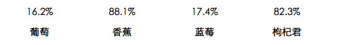

# number



## 基本方法

### new Number(selector[, options])

#### selector
类型：`string`或`object`

同new Chart(selector[, options]) 的selector一样

#### options
类型：`object`

##### options.xaxis.key
类型：`string`

默认为"x"。

##### options.xaxis.type
类型：`string`

默认为"category", 类目型。即{"周一", "周二", "周三"...}这种类型。

##### options.xaxis.orient
类型：`string`

默认为"bottom"型。

##### options.yaxis.key
类型：`string`

默认为"y"。

##### options.yaxis.type
类型：`string`

默认为"default"。

##### options.yaxis.orient
类型：`string`

默认为"left"。

### number.data([data])
与[chart.data([data])](./chart.md)一样。

### number.render([data])

与[chart.render([data])](./chart.md)一样。


### number.destroy()
与[chart.destroy()](./chart.md)一样。

### number.on(event_name, func)
与[chart.on(event_name, func)](./chart.md)一样。

## 数据类型

### 单维
```json
[
    {x: "周一", account: 120},
    {x: "周二", account: 100},
    {x: "周三", account: 123},
    {x: "周四", account: 112},
    {x: "周五", account: 103},
    {x: "周六", account: 135},
    {x: "周日", account: 131}
]
```

### 多维
```json
[
    {x: "周一", account: [110, 120]},
    {x: "周二", account: [100, 133]},
    {x: "周三", account: [123, 98]},
    {x: "周四", account: [101, 112]},
    {x: "周五", account: [99, 103]},
    {x: "周六", account: [145,135]},
    {x: "周日", account: [131, 144]}
]
```
