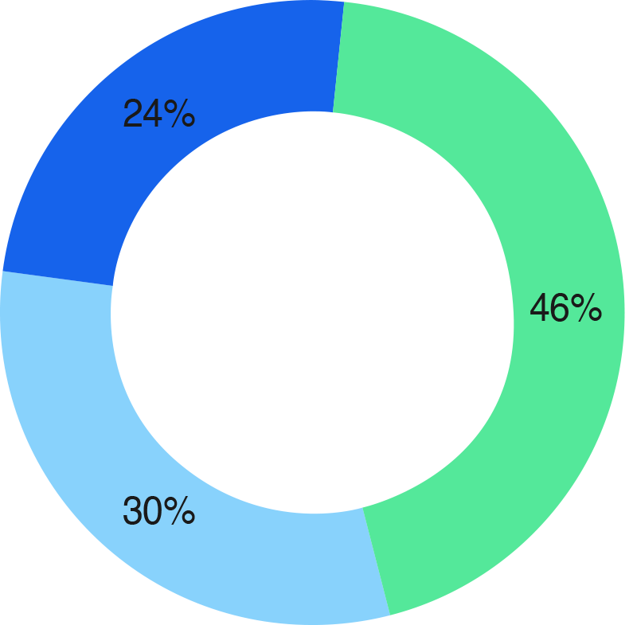
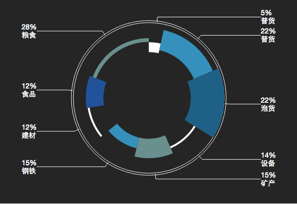

# pie



## 基本方法

### new Pie(selector[, options])

#### selector
类型：`string`或`object`

同new Chart(selector[, options]) 的selector一样

#### options
类型：`object`

##### options.pyaxis.key
类型：`string`

默认为"y"。pie的y轴。

##### options.paxis
类型：`object`

特殊文字排版，默认为null。



##### options.paxis.dr
类型：`number`

折线转角处距离圆心的距离。

##### options.paxis.dx
类型：`number`

文字距离圆心的水平距离。

### area.data([data])
与[chart.data([data])](./chart.md)一样。

### area.render([data])

与[chart.render([data])](./chart.md)一样。


### area.destroy()
与[chart.destroy()](./chart.md)一样。

### area.on(event_name, func)
与[chart.on(event_name, func)](./chart.md)一样。

## 数据类型

### 单维
```json
[
    {x: "2015-11-05", account: 120},
    {x: "2015-11-06", account: 100},
    {x: "2015-11-07", account: 123},
    {x: "2015-11-08", account: 112},
    {x: "2015-11-09", account: 103},
    {x: "2015-11-10", account: 135},
    {x: "2015-11-11", account: 131}
]
```

### 多维
```json
[
    {x: "2015-11-05", account: [110, 120]},
    {x: "2015-11-06", account: [100, 133]},
    {x: "2015-11-07", account: [123, 98]},
    {x: "2015-11-08", account: [101, 112]},
    {x: "2015-11-09", account: [99, 103]},
    {x: "2015-11-10", account: [145,135]},
    {x: "2015-11-11", account: [131, 144]}
]
```