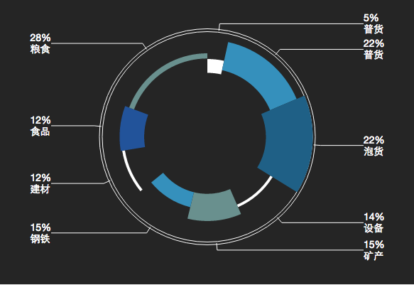

# radar


## 基本方法

### new Radar(selector[, options])

#### selector
类型：`string`或`object`

同new Chart(selector[, options]) 的selector一样

#### options
类型：`object`

##### options.pyaxis.key
类型：`string`

默认为"y"。pie的y轴。

##### options.paxis
类型：`object`

特殊文字排版，默认为null。



##### options.paxis.dr
类型：`number`

折线转角处距离圆心的距离。

##### options.paxis.dx
类型：`number`

文字距离圆心的水平距离。

#### options.arc
类型：`object`

pie的扇形布局，详情请戳[Arc](../plugin/wedget/arc.md)。

#### options.arc.innerRadius
类型：`number`

内半径。

#### options.arc.outerRadius
类型：`number`

外半径。

#### options.arc.padAngle
类型：`number`

角度间距。

#### options.arc.startAngle
类型：`number`

起始角度。

#### options.arc.endAngle
类型：`number`

结束角度。

### area.data([data])
与[chart.data([data])](./chart.md)一样。

### area.render([data])

与[chart.render([data])](./chart.md)一样。


### area.destroy()
与[chart.destroy()](./chart.md)一样。

### area.on(event_name, func)
与[chart.on(event_name, func)](./chart.md)一样。

## 数据类型

### 单维
```json
[{'x': '普货', 'y' : 5},{'x': '普货', 'y' : 22},{'x': '泡货', 'y' : 22},{'x': '设备', 'y' : 14},{'x': '矿产', 'y' : 15},{'x': '钢铁', 'y' : 15},{'x': '建材', 'y' : 12},{'x': '食品', 'y' : 12},{'x': '粮食', 'y' : 28}]