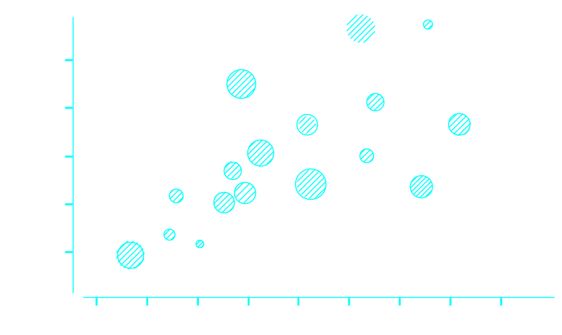

# scatterplot



## 基本方法

### new Scatterplot(selector[, options])

#### selector
类型：`string`或`object`

同new Chart(selector[, options]) 的selector一样

#### options
类型：`object`

##### options.interpolate
类型：`string`

边缘类型。默认为"basic"-圆滑的。

##### options.xaxis.key
类型：`string`

默认为"x"。

##### options.xaxis.type
类型：`string`

默认为"default"，也可以为"time"。

##### options.xaxis.orient
类型：`string`

默认为"bottom"型。

##### options.yaxis.key
类型：`string`

默认为"y"。

##### options.yaxis.type
类型：`string`

默认为"default"。

##### options.yaxis.orient
类型：`string`

默认为"left"。

##### options.raxis.key
类型：`string`

半径的key。可以无，无默认为点图。

### scatterplot.data([data])
与[chart.data([data])](./chart.md)一样。

### scatterplot.render([data])

与[chart.render([data])](./chart.md)一样。


### scatterplot.destroy()
与[chart.destroy()](./chart.md)一样。

### scatterplot.on(event_name, func)
与[chart.on(event_name, func)](./chart.md)一样。

## 数据类型

### 单维
```json
[
    {x: "2015-11-05", account: 120, r: 4},
    {x: "2015-11-06", account: 100, r: 9},
    {x: "2015-11-07", account: 123, r: 2},
    {x: "2015-11-08", account: 112, r: 2},
    {x: "2015-11-09", account: 103, r: 8},
    {x: "2015-11-10", account: 135, r: 11},
    {x: "2015-11-11", account: 131, r: 23}
]
```

### 多维
```json
[
    {x: "2015-11-05", account: [110, 120], r: [4, 9]},
    {x: "2015-11-06", account: [100, 133], r: [7, 3]},
    {x: "2015-11-07", account: [123,  98], r: [2, 3]},
    {x: "2015-11-08", account: [101, 112], r: [4, 4]},
    {x: "2015-11-09", account: [99,  103], r: [8, 10]},
    {x: "2015-11-10", account: [145, 135], r: [10, 2]},
    {x: "2015-11-11", account: [131, 144], r: [2, 2]}
]
```